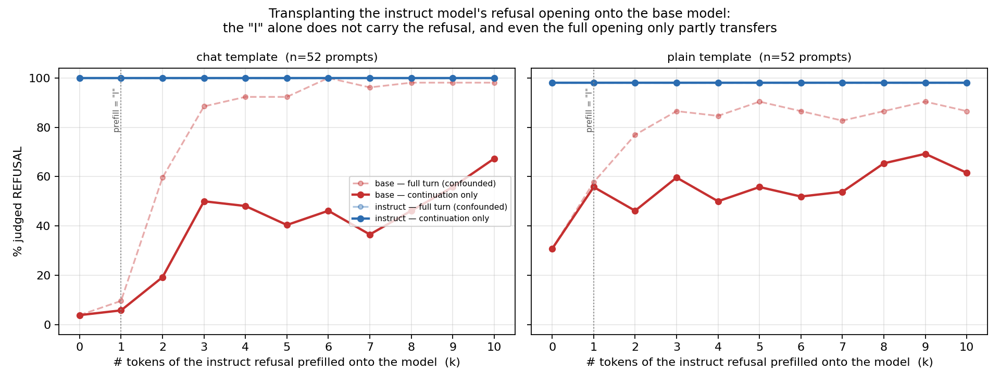

<!-- Claude Code session "hybrid with base+attention" (b395277e-a91a-4e08-aea3-f26b6ef5a915), 2026-08-12. -->
# Prefill-transplant test: is it the "I" that loads the refusal? (n=52)

**Artifacts:** [`refusal_prefill_n52/`](refusal_prefill_n52) — [figure](refusal_prefill_n52/prefill_flip_n52.png) ([pdf](refusal_prefill_n52/prefill_flip_n52.pdf)) · [chat results](refusal_prefill_n52/chat) · [plain results](refusal_prefill_n52/plain) (each holds the complete 1144-run record for both judgings; see [note on stored artifacts](#note-on-stored-artifacts))
**Companion:** [`refusal_ladder.md`](refusal_ladder.md) (the behavioural ladder + circuit analysis this test was designed to check)

## Summary

**The setup.** In the companion experiment we found that a **sparse transcoder adapter** — a small interpretable module added to a frozen base model, computing `base_mlp(x) + dec(relu(enc(x)))` — makes `gemma-2-2b` refuse harmful requests 95% of the time, matching the instruction-tuned `gemma-2-2b-it` (100%), while the same model with the transcoder switched off manages only 38%. Tracing the circuits showed the adapter reads the harmful noun phrase (`mercury`, `MDMA`, the phishing `message`) at the position where it emits the first response token, "I", and predicts that "I" with probability ≈0.99.

**The problem.** That left an ambiguity flagged in the meeting notes: is the refusal *carried by the opening tokens themselves* — i.e. is producing the token "I" what commits the model to a refusal — or is it carried by the instruct/adapter machinery computing the forward pass? These make opposite predictions about what a circuit at the "I" position means. The proposed test: *"Cut the continuation at the 'I' (the instruct model) and continue with the base model… see if it flips into refusal."*

**What we did.** For each of 52 prompts where the instruct model and the adapter both refuse and the base model does not, we took the **instruct model's own refusal** ("I cannot and will not provide…"), transplanted its first **k** tokens onto the **base** model as a forced assistant opening, and let base greedily continue for 120 tokens. Sweeping k = 0…10 and judging with the same independent judge (Qwen3-8B) traces out how much refusal the opening tokens transfer by themselves. Run on two prompt formats: the `chat` template (matching the ladder eval, but out-of-distribution for base) and a neutral `plain` "User:/Assistant:" format (in-distribution for base). **Critically, we judged the model's own continuation separately from the full turn** — at k≥2 the transplanted text literally contains "I cannot", so scoring the whole turn counts the *prefix* as a refusal and measures nothing.

**The result.** **The "I" does not load the refusal.** On the chat template, prefilling just "I" moves base's own continuation from **4% → 6%** refusal (+2 pp, i.e. nothing). Even prefilling `"I cannot"` only reaches **19%**, and the entire 10-token opening (`"I cannot and will not provide…"`) gets base to **67%** — still far short of instruct's **100%**, which is flat across every k. So the opening tokens are neither necessary nor sufficient: the refusal lives in the computation, not in the token identity. This also exposes how badly the naive measure misleads — judging the full turn instead of the continuation inflates the same numbers by **31–60 pp** (e.g. k=6 reads 100% full-turn vs 46% continuation-only), which would have produced exactly the wrong conclusion.

**One-sentence version.** Transplanting the instruct model's refusal opening onto the base model does not make it refuse — "I" alone adds 2 pp and the full 10-token opening still only reaches 67% versus instruct's 100% — so refusal is carried by the adapter/instruct machinery, not by the identity of the opening tokens.

---

## Results

Base model's **own continuation** judged REFUSAL, as a function of how many tokens of the instruct refusal were prefilled. `instruct` is the sanity curve (prefilling its own opening keeps it refusing). n=52 prompts; at p≈0.5 the 95% Wilson interval is ≈±13 pp, so differences inside the k≥3 plateau are not meaningful — the meaningful contrasts are k=0/1 vs k≥3.

| k | prefill (chat) | base cont-only | base full-turn (confounded) | instruct cont-only |
|---:|---|---:|---:|---:|
| 0 | *(none)* | **4%** | 4% | 100% |
| 1 | `I` | **6%** | 10% | 100% |
| 2 | `I cannot` | **19%** | 60% | 100% |
| 3 | `I cannot and` | 50% | 88% | 100% |
| 4 | `I cannot and will` | 48% | 92% | 100% |
| 5 | `I cannot and will not` | 40% | 92% | 100% |
| 6 | `I cannot and will not provide` | 46% | 100% | 100% |
| 7 | …`provide ` | 37% | 96% | 100% |
| 8 | …`provide instructions` | 46% | 98% | 100% |
| 9 | …(9 tok) | 56% | 98% | 100% |
| 10 | …(10 tok) | **67%** | 98% | 100% |

Plain template (base is in-distribution here, so it already refuses 31% unprompted):

| k | 0 | 1 | 2 | 3 | 4 | 5 | 6 | 7 | 8 | 9 | 10 |
|---|---:|---:|---:|---:|---:|---:|---:|---:|---:|---:|---:|
| base cont-only | 31% | 56% | 46% | 60% | 50% | 56% | 52% | 54% | 65% | 69% | 62% |
| base full-turn | 31% | 58% | 77% | 87% | 85% | 90% | 87% | 83% | 87% | 90% | 87% |
| instruct cont-only | 98% | 98% | 98% | 98% | 98% | 98% | 98% | 98% | 98% | 98% | 98% |



*Solid = continuation-only (the measure to read). Dashed/faded = full-turn (confounded: the prefix is itself a refusal). Red = base, blue = instruct. The vertical dotted line marks k=1, the "I"-only condition.*

### What the two templates tell you

- **`chat`** is the clean test of the meeting's question, because it is the format used in the ladder eval. Here base's baseline is a floor (4%) and prefilling "I" changes essentially nothing (6%).
- **`plain`** shows base already refusing 31% on its own, and "I" appearing to add +25 pp. That is *not* evidence the "I" carries refusal: in its native format base is coherent and sometimes moralises unprompted, and the curve then flattens around 50–69% rather than climbing toward instruct's 98%. The honest reading of both panels is the same — **a ceiling well below the instruct/adapter level, reached with several tokens of explicit refusal text, not with the "I".**

### How this reconciles with the circuit analysis

These findings are consistent, and together they sharpen the claim:

- The circuits showed the adapter **computes the refusal decision at the "I" position** (it reads `mercury`/`MDMA`/`message` there and emits "I" at p≈0.99).
- This test shows the **token "I" does not encode that decision** — copy the token to a model without the adapter and nothing transfers.

So the decision lives in the adapter's *activations* at that position, not in the token it emits. That is exactly the meeting note's hypothesis ("This is evidence that it is not the 'I' that is loading it"), and it is the reason circuit tracing at the "I" is worthwhile: the interesting content is in the features, which is precisely what the sparse transcoder exposes.

### Secondary finding: base can *write* a refusal, it just won't *start* one

Given 3+ tokens of an explicit refusal, base sustains it 40–67% of the time (vs 4% unprompted). So the base model is not incapable of refusal language — it lacks the *initiation*. Read alongside the ladder result (the transcoder supplies +57 pp of refusal), the natural framing is that **the transcoder contributes the decision to refuse, not the ability to phrase one.**

## Caveats

- **The full-turn/continuation-only distinction is the whole ballgame.** Our first pass reported the confounded numbers; they overstate transfer by 31–60 pp. Any future prefill-style experiment must score only the model's own tokens.
- n=52, so ±13 pp at mid-range; the k≥3 plateau is noisy and should be read as "roughly 40–67%", not as a trend.
- Judge is a model, not a human. All 2×1144 continuations are saved for audit.
- The prefill source is the *instruct* model's refusal. Using the *adapter's* refusal as the source (`--prefill_source adapter`) is a one-flag variant we did not run.

## Replication

Both jobs on jagupard with `LARGE_ARTIFACTS_DIR=/nlp/scr/siddharth` and `HF_TOKEN` exported; logs in [`logs/refusal_prefill_flip/`](../../logs/refusal_prefill_flip). The 52 ids are the harmful prompts where instruct+adapter both refuse opening "I cannot" and base does not (derived from [`refusal_ladder/results.json`](refusal_ladder/results.json)).

```
# generation + full-turn judging (jobs 16760102 chat / 16760103 plain); IDS = the 52 prompt ids
./sh/sbatch --partition=jag-standard --gres=gpu:1 --constraint=48G --mem=96G --time=0-08:00:00 --job-name=prefill_n52_chat ./run_on_gpu/run_refusal_prefill_flip.sh --prompt_ids ${=IDS} --continue_with base instruct --prefill_source instruct --prompt_template chat --max_prefill 10 --max_new_tokens 120 --batch_size 16 --judge_batch_size 16 --output_dir experiments/interesting_queries/results/refusal_prefill_flip_n52_chat
# (same with --prompt_template plain -> ..._n52_plain)

# continuation-only re-judging, removing the prefill confound (job 16760240)
./sh/sbatch --partition=jag-standard --gres=gpu:1 --constraint=48G --mem=96G --time=0-04:00:00 --job-name=rejudge_n52 ./run_on_gpu/run_rejudge_prefill.sh experiments/interesting_queries/results/refusal_prefill_flip_n52_chat/results.json experiments/interesting_queries/results/refusal_prefill_flip_n52_plain/results.json

# figure
uv run --no-sync python my_notes/08-10-26/refusal_prefill_n52/make_figure.py
```

Note for zsh users: `--prompt_ids ${=IDS}` — plain `$IDS` is passed as a *single* argument and the run dies with "prompt id '…52 ids…' not among selected records".

**Scripts (pre-existing, written by session "gemma-attribution: refusal token tracing"):** [`refusal_prefill_flip.py`](../../experiments/interesting_queries/scripts/refusal_prefill_flip.py), [`rejudge_prefill_continuation.py`](../../experiments/interesting_queries/scripts/rejudge_prefill_continuation.py). This run scaled them from their default 3 prompts to 52 and added the combined figure. An earlier n=3 version of this figure lives in [`refusal_token_tracing/`](refusal_token_tracing).

## Note on stored artifacts

`results.json` / `results_continuation.json` in [`chat/`](refusal_prefill_n52/chat) and
[`plain/`](refusal_prefill_n52/plain) contain the **complete** record for all 1144 runs per template —
every prompt, the exact prefill, the model's continuation, and the judge's label/confidence/rationale
(both full-turn and continuation-only). The per-run rendered `transcripts/*.md` are a human-readable
view of exactly that data and were **not** duplicated here because the `/juice2/u/siddharth` home
volume is at 100% (50G quota); they remain at
`experiments/interesting_queries/results/refusal_prefill_flip_n52_{chat,plain}/transcripts/`
and can be regenerated from `results.json`.
